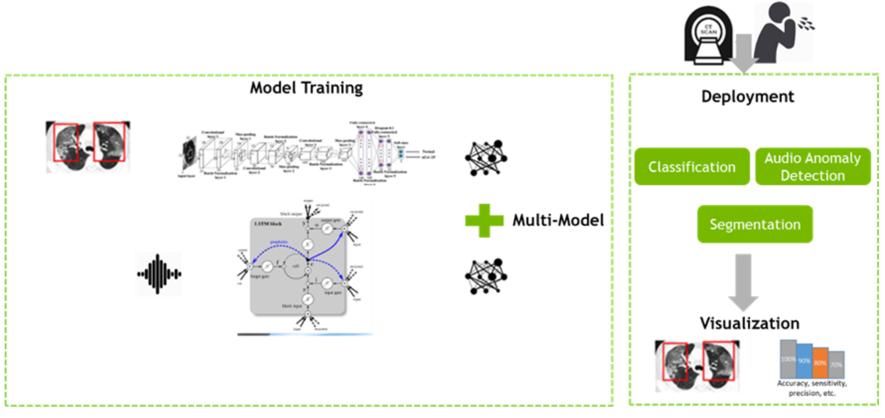

# DreamAI 2020

Project 예선 기간: 2020년 11월 4일 → 2020년 11월 13일
본선 기간: 2020년 11월 23일 → 2020년 12월 11일

[꿈꾸는아이](https://dreamai.kr/fair_nvidia)

# Overview

## Dream AI Healthcare Hackathon 2020

- AI  기술을 활용하여 COVID-19와 같은 바이러스 확산을 예측, 최소화 및 차단하는데 도움이 되기 위한 문제를 GIST-NVIDIA에서 출제
- 해커톤 문제
    1. Covid19에 대한 의료 진단 챌린지
    2. 공공 서비스 지역에 대한 국민 건강 감시 챌린지
    3. 헬스케어 부분 오픈 경진대회
- 이 중 1번 챌린지에 참여하였고 최종 4등

## Covid19에 대한 의료 진단 챌린지

CT/X-ray 등의 의료 영상은 COVID-19 진단에 중추적 역할을 한다. 그리고 기침은 COVID-19의 주요 증상이므로 COVID-19 양성 사례를 감지하는데 도움이 될 수 있다. 본 챌린지에서는 이미지와 오디오를 동시에 통합하는 DL 파이프라인을 구축하여 정확도를 향상시키는 것을 목표로 한다.

# Reference Dataset

1. COVIDx dataset (Image)

[iliasprc/COVIDNet](https://github.com/iliasprc/COVIDNet)

2. Coswara dataset (Audio)

[iiscleap/Coswara-Data](https://github.com/iiscleap/Coswara-Data)

# Method

- 처음에는 unpaired image(X-ray)와 audio를 통합하여 성능을 향상시키는 모델을 제안
- 그러나, audio data만 사용하였을 때 성능이 좋지않아서 상대적으로 성능이 높은 image data를 이용하여 audio model의 성능을 향상시키는 것으로 방향을 변경
- image model의 backbone은 resnet50을 사용하였고 audio model의 backbone은 resnet22 (*PANNs)를 사용

[PANNs: Large-Scale Pretrained Audio Neural Networks for Audio Pattern Recognition](https://arxiv.org/abs/1912.10211)

- audio model의 성능을 높이기 위해서 아래의 논문을 참조하여 Supervised Domain adaptation을 적용

[Unified Deep Supervised Domain Adaptation and Generalization](https://arxiv.org/abs/1709.10190)

## Proposed Model

- Semantic alignment loss : 다른 domain의 같은 label을 가지는 data들의 거리를 최소화
- Spearation loss : 다른 domain의 다른 label을 가지는 data들의 거리를 최대화
- 위 loss를 이용하여 audio model의 성능을 향상

## Delployment

- model deplyment를 위해서 tensorRT(fp16)를 사용하여 model의 throughput과 latency를 향상
- 특히 latency의 향상(0.23ms)으로 실시간으로 서비스가 가능

# Demo Website

# 평가 기준

## 예선

- 상황 관련성 : COVID-19 관련 국가의 의료 관련 문제 해결에 큰 영향을 미치는지 여부
- 기술적 우월성 : 최신 기술 및 트렌드 사용, 더 나은 성능 및 정확성을 갖는지 여부
- 혁신 지수 : 연구 지수가 높고 고유한 솔루션이 될 가능성이있는 혁신적인 해결방법인지 여부
- 실행 가능성 : 솔루션은 솔루션 비용, 기존 인프라로의 손쉬운 통합 및 현장에서의 손쉬운 배포를 고려하여 실제 시나리오에서 실질적으로 실행 가능한지 여부

## 본선

- 1R (기술경쟁) : 예선 결과물에 대해 기술성 중심의 PT 발표
- 2R (배틀경쟁)
    - 예선 결과물에 대해 기술적인 내용에 더하여 비지니스 모델을 추가하여 PT 발표
    - 양 팀의 배틀 형식
- 3R (BM경쟁)
    - 투자사 및 BM전문가가 포함된 심사위원단이 평가

